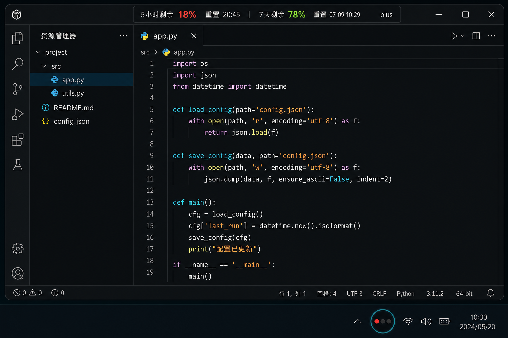
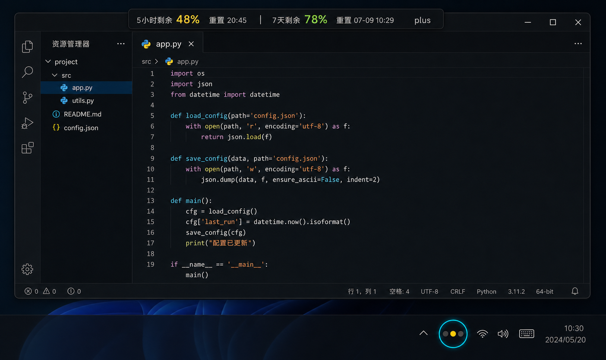

# Codex Usage Overlay / Codex 用量指示条

An unofficial, lightweight Windows overlay for monitoring Codex usage limits.

一款非官方、轻量级的 Windows Codex 用量悬浮工具。

<p align="center">
  
</p>

<p align="center">
  
</p>

## English

Codex Usage Overlay attaches to the top of the Codex desktop window and displays the remaining usage for the 5-hour and 7-day rate-limit windows. Ordinary text stays white, while percentage values change color according to the remaining quota:

- **Red:** below 30%
- **Yellow:** 30% to below 60%
- **Green:** 60% and above

The Windows notification-area icon follows the same red, yellow, and green status. Right-click the tray icon to exit the program. The overlay automatically hides when Codex is minimized, closed, or no longer the foreground application, and reappears when Codex becomes active again.

### Features

- Real-time 5-hour and 7-day remaining usage
- Color-coded percentage values
- Dynamic red/yellow/green system tray icon
- Compact top-edge overlay that avoids Codex window controls
- Automatic hide and restore with the Codex window
- Right-click tray menu for exiting the background process
- One-click synchronized startup with Codex
- Reads local Codex session snapshots without calling an account API
- No external Python dependencies

## 中文

Codex 用量指示条会吸附在 Codex 桌面窗口顶部，实时显示 5 小时和 7 天限额窗口的剩余用量。普通文字保持白色，只有百分比数字会根据剩余额度自动变色：

- **红色：** 低于 30%
- **黄色：** 30% 至低于 60%
- **绿色：** 60% 及以上

Windows 任务栏通知区域的图标也会同步显示红、黄、绿状态。右键托盘图标可退出程序。当 Codex 最小化、关闭或不在前台时，指示条会自动隐藏；重新切回 Codex 后自动恢复显示。

### 功能特点

- 实时显示 5 小时与 7 天剩余用量
- 百分比数字红、黄、绿分级提醒
- 托盘图标同步显示当前余量状态
- 紧凑吸附在窗口顶部，不遮挡 Codex 窗口控制按钮
- 随 Codex 最小化、关闭和前后台切换自动隐藏或恢复
- 托盘右键菜单可彻底退出后台程序
- 支持与 Codex 一键同步启动
- 直接读取本机 Codex 会话快照，不调用账号 API
- 无第三方 Python 依赖

## Requirements / 运行要求

- Windows 10 or Windows 11
- Python 3.10+
- Codex desktop app

## Quick Start / 快速启动

Double-click `run_overlay.bat`, or run:

双击 `run_overlay.bat`，或者运行：

```powershell
python .\codex_usage_overlay.py
```

## Start with Codex / 与 Codex 同步启动

Run once to create the `Codex Usage Overlay` desktop shortcut:

运行一次以下命令，创建 `Codex Usage Overlay` 桌面快捷方式：

```powershell
powershell -ExecutionPolicy Bypass -File .\create_desktop_launcher.ps1
```

Use that shortcut to start Codex and the overlay together.

以后使用该快捷方式，即可同时启动 Codex 和用量指示条。

## Start with Windows / 开机启动

Enable:

```powershell
powershell -ExecutionPolicy Bypass -File .\install_startup.ps1
```

Disable:

```powershell
powershell -ExecutionPolicy Bypass -File .\uninstall_startup.ps1
```

## Exit / 退出

Right-click the notification-area icon and select `退出程序`.

右键任务栏通知区域图标，选择 `退出程序`。

## Data Source / 数据来源

The program reads the latest `token_count.rate_limits` snapshot from local Codex session files under `~/.codex/sessions`. It does not read authentication tokens or call a private account API.

程序从 `~/.codex/sessions` 下的本地 Codex 会话文件读取最新的 `token_count.rate_limits` 快照，不读取身份验证令牌，也不调用私人账号 API。

## Disclaimer / 免责声明

This is an unofficial community utility and is not affiliated with or endorsed by OpenAI.

这是一个非官方社区工具，与 OpenAI 无隶属或背书关系。
